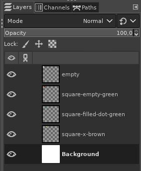
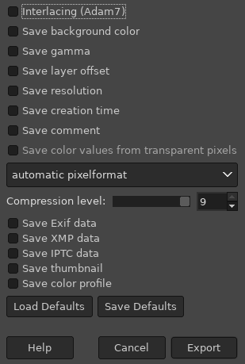

# resources from png files

## editing resources

* edit gimp files `sprites.xcf`, `tiles.xcf` and `overlay.xcf`
* suggestion is to create a layer for each sprite / tile
* `sprites.xcf`, `tiles.xcf`, `overlay.xcf` can use different palettes
* `sprites.xcf` and `overlay.xcf` background color is index 0 and represents
  transparent pixel

## exporting to png

* enable all layers

* File -> Export As...

## extracting resources

* script `update.sh` overwrites files in `../resources/`
  * `palette_sprites.hpp`
  * `palette_tiles.hpp`
  * `palette_overlay.hpp`
  * `sprite_imgs.hpp`
  * `tile_imgs.hpp`
  * `overlay_imgs.hpp`
* default size of sprites and tiles is 16 and can be changed,
  e.g., `update.sh 32`

note: _check that transparency pixel is index 0_

## current resources

### tiles

### sprites

### overlay

