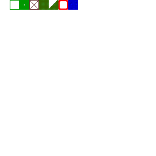
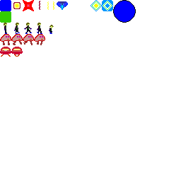

# resources from png files

## editing resources
* edit gimp files `sprites.xcf` and `tiles.xcf`
* suggestion is to create a layer for each sprite / tile
* `sprites.xcf` and `tiles.xcf` can use different palettes
* `sprites.xcf` background color is index 0 and represents transparent pixel

## exporting to png
* enable all layers

* File -> Export As...

## extracting resources
script `update.sh` will overwrite files in `../resources/`

if necessary, change size of tiles and sprites in `update.sh`

_note: check that transparency pixel is index 0_

## current resources
### tiles

### sprites

